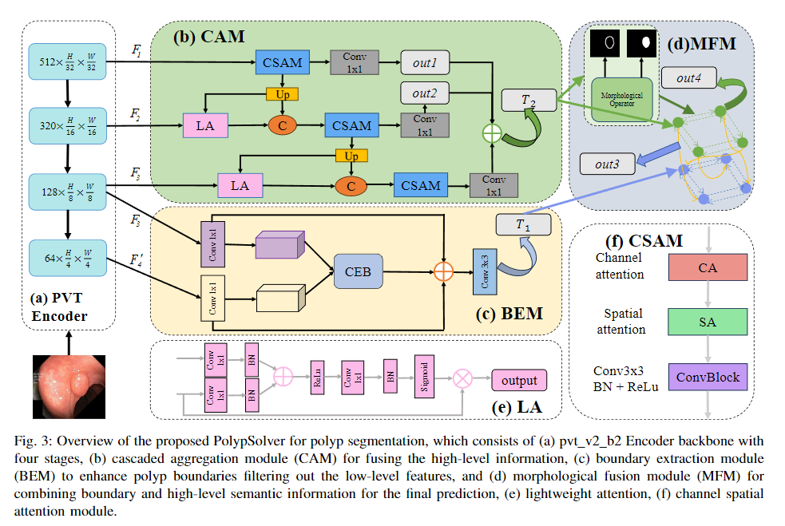
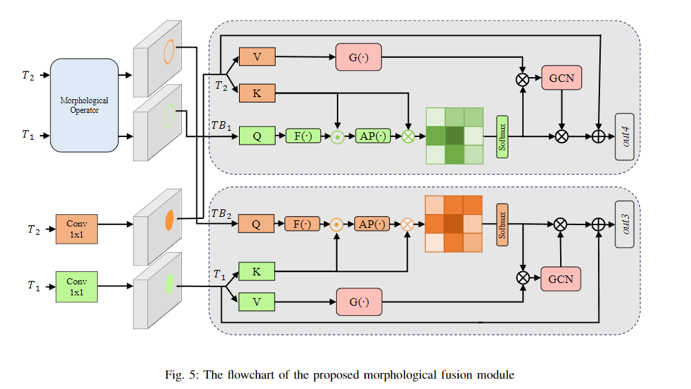
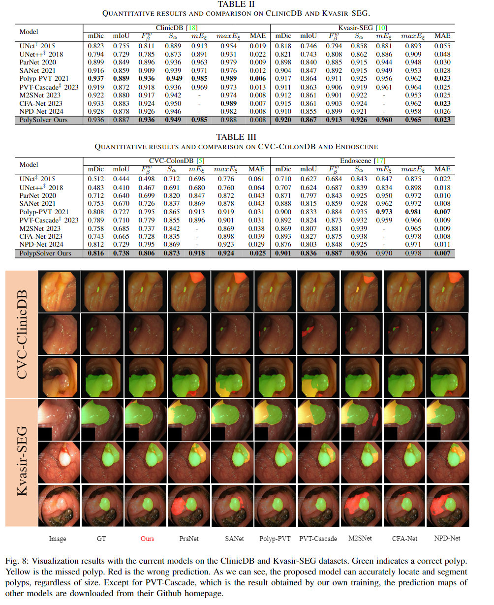

<h2 align="center">PolypSolver: Crossed Non-local Network for Polyp Segmentation with Morphological Operators</h2>
<h4 align="right">by <a href="https://github.com/Parker-rfu/Parker-rfu">Renyu Fu</a></h4>

<div align="center">
  <br><br>
</div>
<div align="center">
  <br><br>
</div>
<div align="center">
  <br><br>
</div>
<div align="center">
  <br><br>
</div>

This is an official implementation of PolypSolver in our paper "
<a href="https://ieeexplore.ieee.org/document/10471227">
PolypSolver: Crossed Non-local Network for Polyp Segmentation with Morphological Operators</a>"

## Note
* Our code is based on the <a href="https://github.com/DengPingFan/PraNet">PraNet</a>, <a href="https://github.com/DengPingFan/Polyp-PVT">Polyp-PVT</a> implementation.
* result_map.zip is the test result of PolypSolver.


## Citation
If you use PolypSolver in your research, please cite our paper.

```text

```
 
## update status
The code (V2.0) is uploaded (Ongoing updates).
